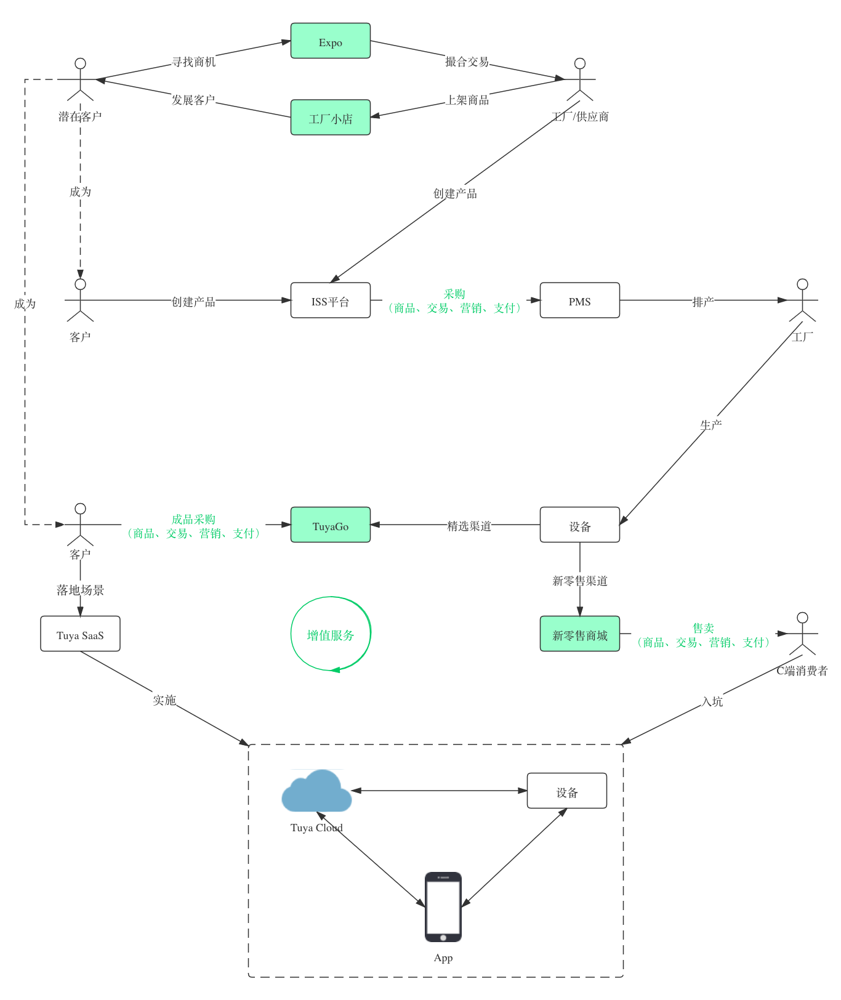
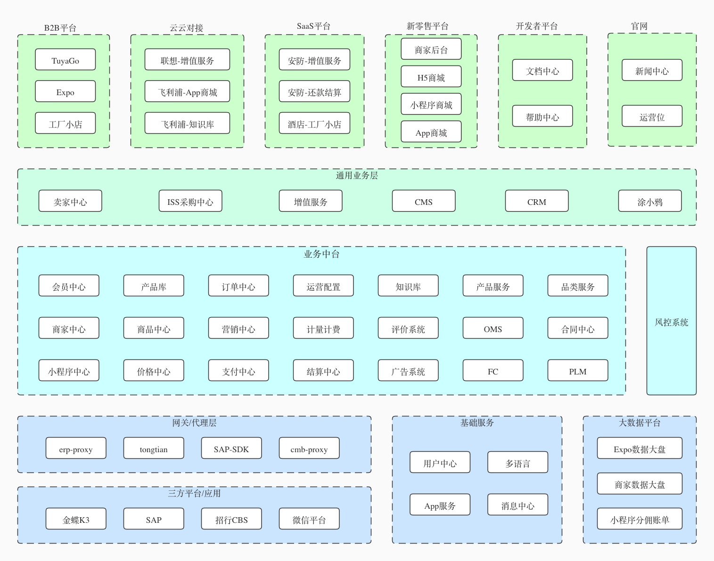
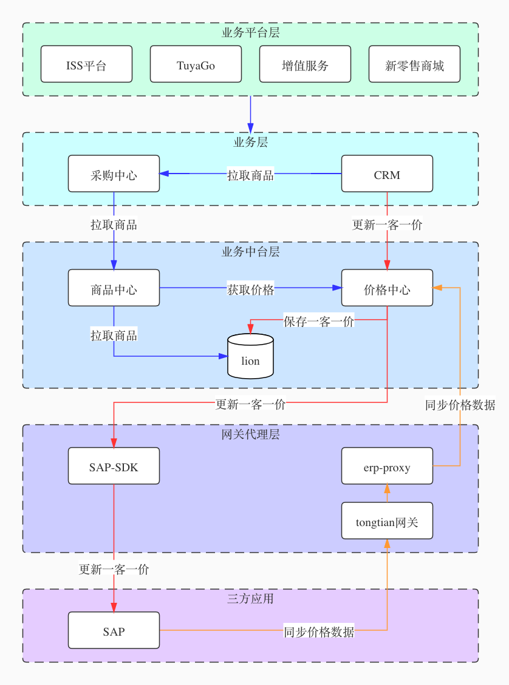
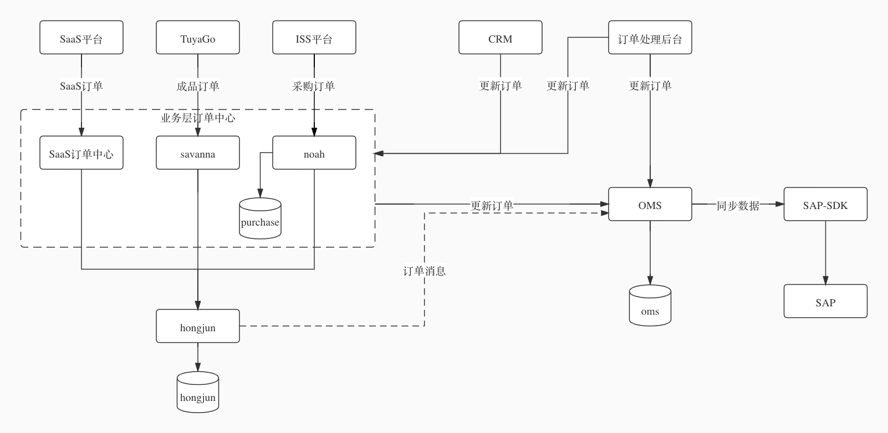

随着公司的发展，业务的深入，相应地团队也会随之壮大，作为团队TL，要考虑的不只是做什么，同时还要让团队与当初十来个人的小团队一样保持高效运转。现有的人double，每个小团队分配下好像也没啥大问题，假如现有人数乘以十，目前的方法就行不通了。我们得去思考未来团队的样子，从现在开始就要为以后的团队搭建骨架，未雨绸缪。

如何搭建能自我成长团队？

#### 一、最关键的因素是人
----

**人才框架**

每个小团队是一个作战单位，不超过7人，搭配一个架构师（或者有TL充任），4个主力开发，2个后备力量。
- *架构师* 参照龙生，雅西项目与龙生的协作中，发现他能快速地熟悉整一个业务，厘清重点，同时把团队盘活。
- *主力开发* 参照熊雷或者维佳，他们都对代码（技术）有追求，会不断地重构，代码在他们手上不会腐化。
- *后备力量* 实习生或者1到2年的新手，有成长为架构师或者主力开发的潜力，培养价值大。

**团队文化**

不断精进，拓宽舒适区。
- *清晰团队目标* 一起参与架构的设计，游离于团队之外、工作不认真的需及时换血。
- *向前多走一步* 了解其他团队的业务，建立自己的业务知识体系。
- *吃亏精神* 多承担一些，保证业务快速平稳落地。
- *持续学习* 虽然平时工作很忙，还是要不停地学习充电，这样才能跑在业务的前面。

#### 二、其次是上下同欲的目标
----

业务目标可能随着公司的战略或者决策的变化会有所调整，要做到与团队及时同步。

**做好生态的一环，同时赋能生态的其他环节**

以现有的几个业务为例：
- *官网* 可以让人们知道我们在做什么，他们能做什么以及能得到什么。
- *Expo* 以比较具体的观感告诉人们：原来是这样，竟然可以这样，那我也要这样。以前纯靠BD走线下，现在即可以线下也可以线上，未来大部分走线上。
- *工厂小店* Expo可以给我导流、酒店SaaS可以给我导流，我也要自己拓展业务，店铺就是我的名片。 

**完善业务中台能力**

无论是TuyaGo、新零售商城还是增值服务，本质都是电商，脱离不了商品、交易、营销和支付这一套，既要做好生态的一环，也要提升平台的竞争力。做到有需要就可以快速支持，插拔式，不会延误战机。

商品能力、交易能力、支付能力、营销能力、会员积分等，可根据业务形态和合作形态选择性接入，整体打包私域部署也行。

#### 三、附录
----
(TG&TM在业务链路上的作用图)

(TG&TM业务平台架构图)

(核心链路之商品链路图)

(核心链路之交易链路图)

